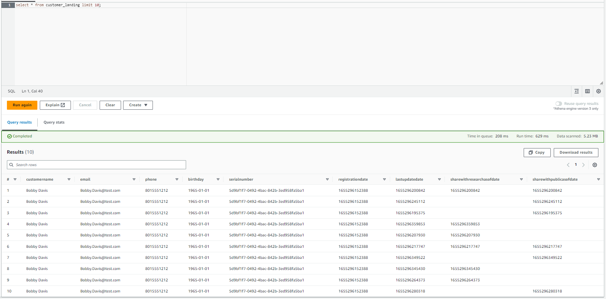
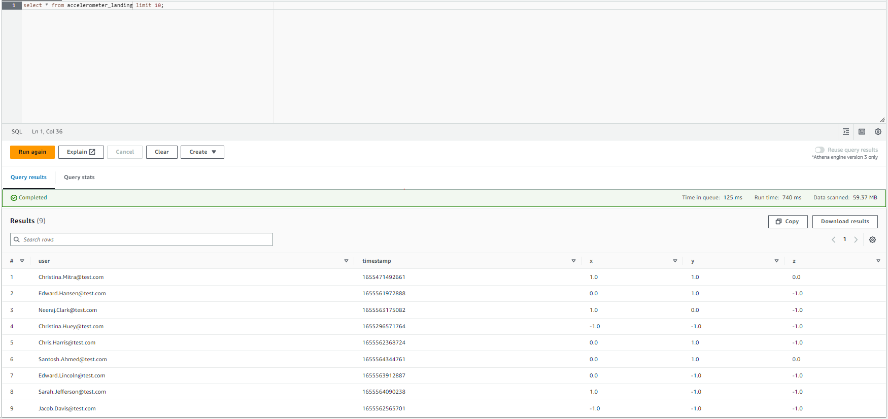
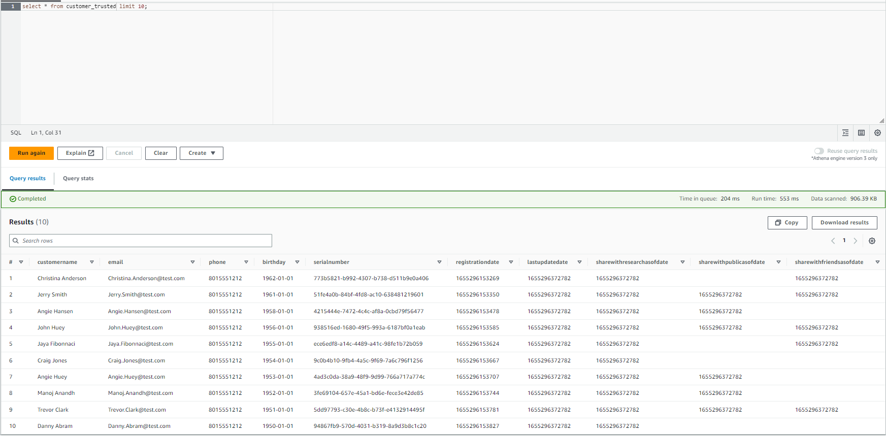
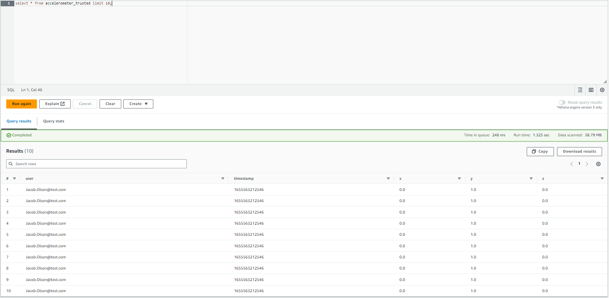
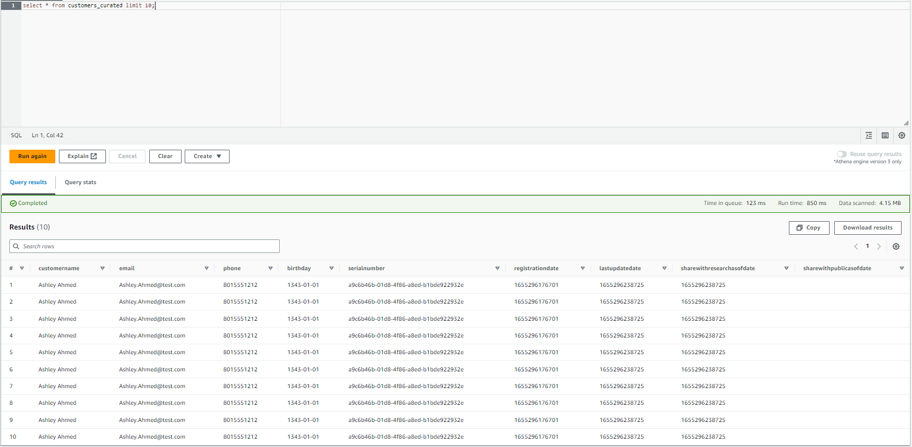

# Project: STEDI Human Balance Analytics

## Project Instructions
Using AWS Glue, AWS S3, Python, and Spark, create or generate Python scripts to build a lakehouse solution in AWS that satisfies these requirements from the STEDI data scientists.

## Implementation

### Landing Zone

**Customer Landing**:
[customer_landing.sql](script/customer_landing.sql)
<figure>
  
</figure>

**Accelerometer Landing**:
[accelerometer_landing.sql](script/accelerometer_landing.sql)
<figure>
  
</figure>

### Trusted Zone

**Customer Trusted**:
[customer_landing_to_trusted.py](script/customer_landing_to_trusted.py)
[customer_trusted.sql](script/customer_trusted.sql)
<figure>
  
</figure>

**Accelerometer Trusted**:
[accelerometer_landing_to_trusted.py](script/accelerometer_landing_to_trusted.py)
[accelerometer_trusted.sql](script/accelerometer_trusted.sql)
<figure>
  
</figure>

### Curated Zone

**Customer Curated**:
[customer_trusted_to_curated.py](script/customer_trusted_to_curated.py)
[customers_curated.sql](script/customers_curated.sql)
<figure>
  
</figure>

**Step Trainer**:
[step_trainer_landing_to_trusted.py](script/step_trainer_landing_to_trusted.py)

**Machine Learning Curated**:
[machine_learning_curated.py](script/machine_learning_curated.py)